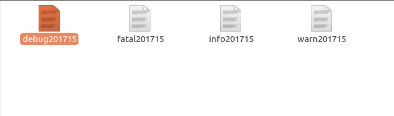

# CLog
A very useful, and thread-safety log library based on linux. Using c++ 11 to implement.

# How to use
1. Installing this library using 
>sudo make install 

2. Linking the library If using CMAKE you can write you CMake content like this
>
SET(CMAKE_CXX_FLAGS "${CMAKE_CXX_FLAGS} -std=c++11")  
ADD_EXECUTABLE(test1 newsimpletest.cpp)  
TARGET_LINK_LIBRARIES( test1  
CLOG  
)

#Sample Code
1 .Firstly including #include "log.h"  
2 .Secondly writing source code like below  
```c++
CLOG::Log::GetInstance()->Init("/home/ethan/log");
for (int i = 0; i < 10; i++)
     CLOG::Log::GetInstance()->Logging(CLOG::LogFile::LogLevel::LogDebug, "try to output debug %d", i);
for (int i = 0; i < 10; i++)
     CLOG::Log::GetInstance()->Logging(CLOG::LogFile::LogLevel::LogInfo, "try to output info %d", i);
for (int i = 0; i < 10; i++)
     CLOG::Log::GetInstance()->Logging(CLOG::LogFile::LogLevel::LogWarnning, "try to output warning %d", i);
for (int i = 0; i < 10; i++)
     CLOG::Log::GetInstance()->Logging(CLOG::LogFile::LogLevel::LogFatal, "try to output fatal %d", i)
```

#Result
This library will generate log files every day for each log level.

