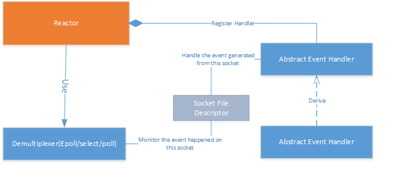
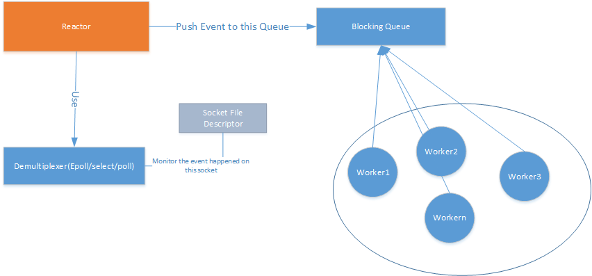
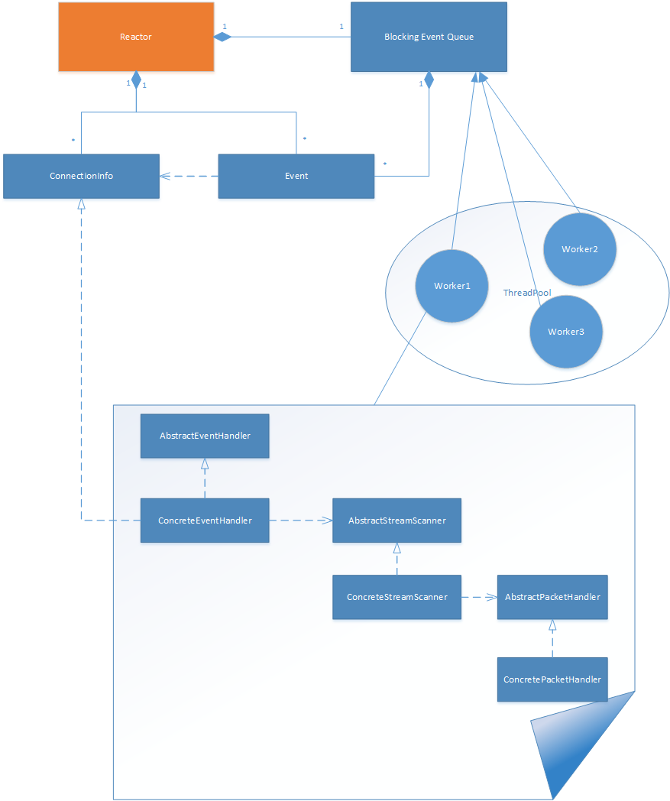

# TCP Server
A high efficient Tcp server based on Epoll, Using reactor and producer consumer threadpool pattern. And use memory pool to improve the efficiency. prefer to use binary protocol to support some financial trading.  

Instruction  
###  1. Simply introduce the Reactor pattern.   
Usually the reactor pattern use one process and one thread. The main goal of Reactor pattern is to seperate the application sepecific code. 

### 2. Reactor pattern with threadpool

  

### 3.The detail of worker

  

  
